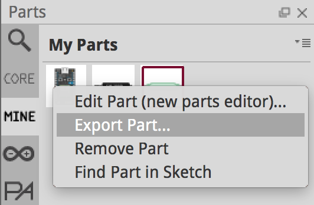
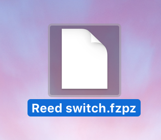
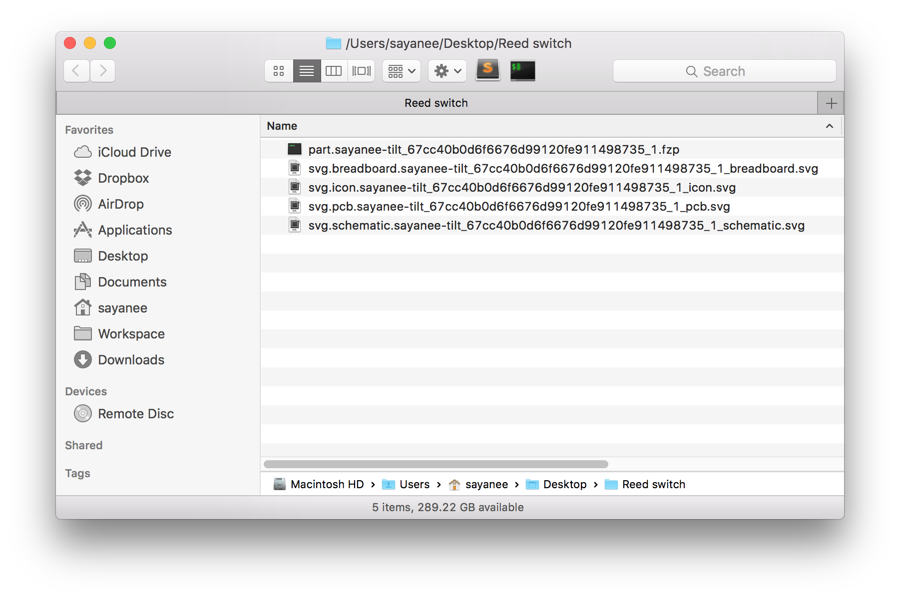
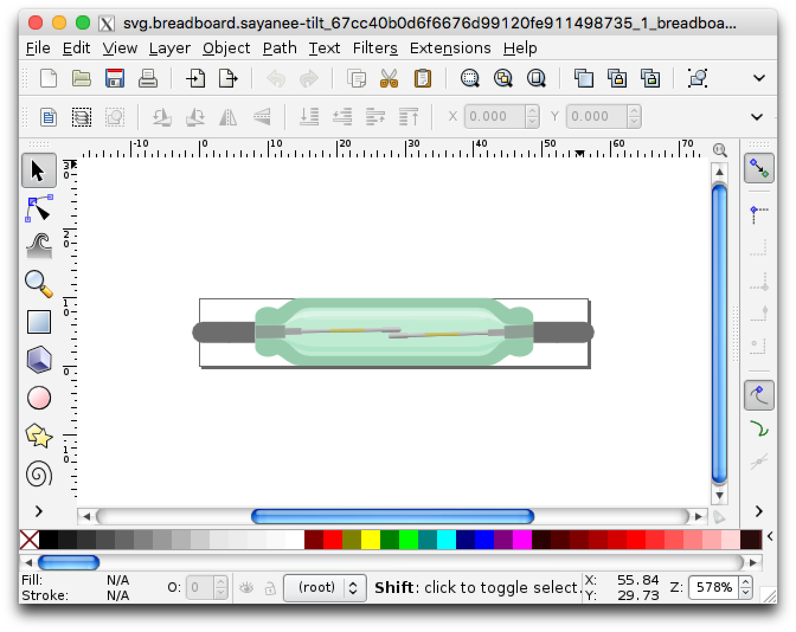
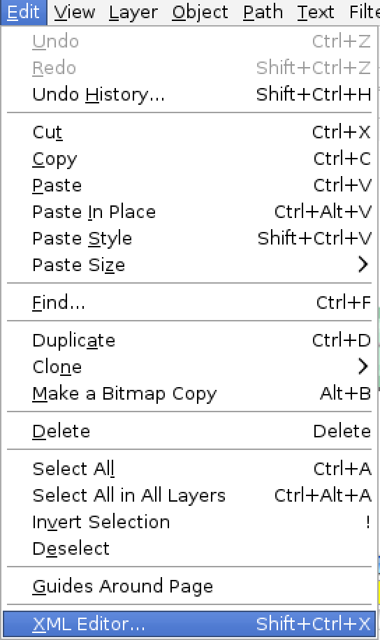
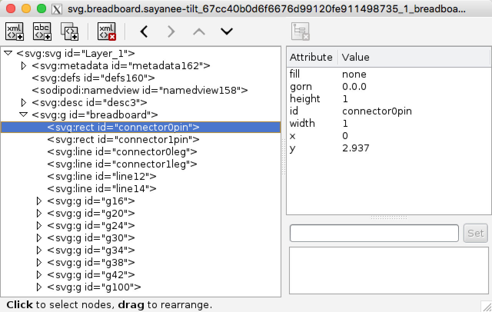
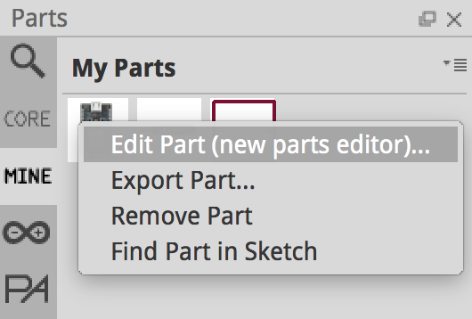
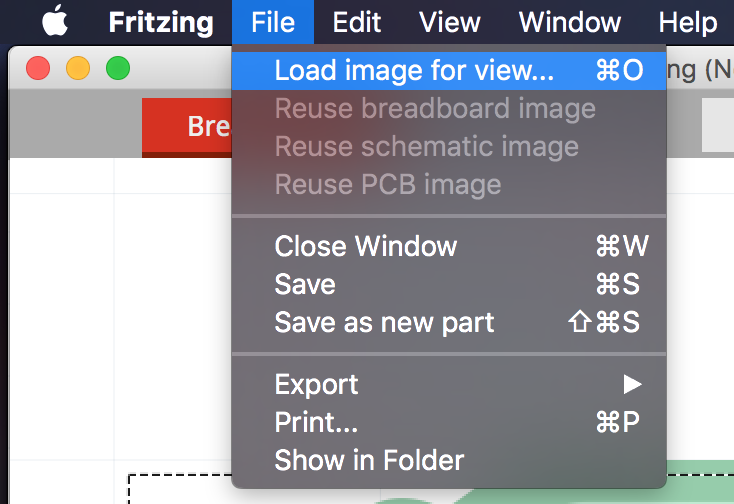

# Fritzing

> Create new parts with Fritzing

Shared at [Hackware v1.7](https://www.facebook.com/events/180525638991544/)

## Download relevant applications

1. [Fritzing](http://fritzing.org/home/)
- [Inkscape](https://inkscape.org/)

## Create a new part

1. Search for a similar part in the right Search window
- It is always better to start with an existing part. `Right Click` > `Export part...`

  
- Save as `*.fzpz`

  
- Rename the file `*.fzpz` to `*.zip`
- Unzip the file and it will have some `*.svg` files to edit inside

  
- Edit the `*.svg` files in Inkscape

  
- In Inkscape, view the SVG xml structure

  
  
- Save the SVGs accordingly
- In Fritzing, right click the part to edit

  
- Load the edited SVG in the relevant views for `Breadboard`, `Icon`, `Schematic` or `PCB`

  
- Save new part and use it right away!

## Other resources on how to create parts

- [Creating custom parts](http://fritzing.org/learning/tutorials/creating-custom-parts/)
- [Make Your Own Fritzing Parts](https://learn.sparkfun.com/tutorials/make-your-own-fritzing-parts)
- [Fritzing - Creating Your Own Parts](http://www.instructables.com/id/Fritzing-Creating-Your-Own-Parts/)
- [Creating a part for Fritzing](https://www.element14.com/community/people/Workshopshed/blog/2015/03/27/creating-a-part-for-fritzing)
- [Making Parts in Fritzing (2014)](https://www.youtube.com/watch?v=-JbKdQ7-YDE)

## Parts libraries

- [Fritzing library by Adafruit](https://github.com/adafruit/Fritzing-Library)
- [Fritzing parts by SparkFun](https://github.com/sparkfun/Fritzing_Parts)
- [Fritzing parts by Fritzing](https://github.com/fritzing/fritzing-parts)
