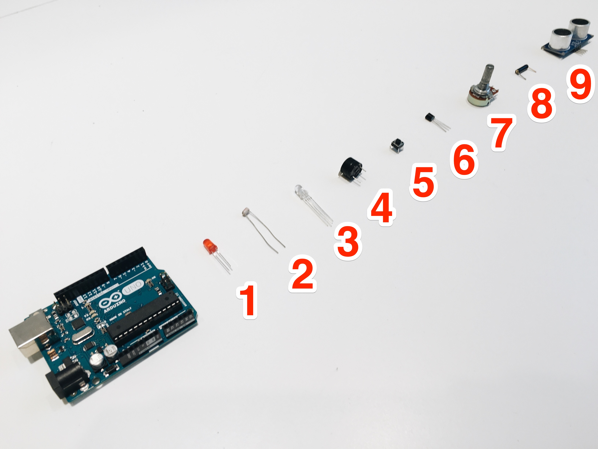

# Web and sensors

> a workshop on connecting various sensors and web technologies

## Quick start

1. Install dependancies `npm i`
- Start the presentation slides in browser `npm start`
- Go through the sample code in directory `code`

## Camera view

1. Plug the USB camera
- Change the camera source in [Chrome Settings > Content > Camera](http://stackoverflow.com/a/14617402/496797)
- Go to the [camera page](http://localhost:8000/camera.html)

## Prepare before the workshop

### Software

1. Download [Arduino IDE](https://www.arduino.cc/en/Main/Software) in your laptop
- Download [Fritzing](http://fritzing.org/download/) in your laptop
- Install a text editor of your choice to code Node.js and Frontend (HTML, CSS, JavaScript)
- Install [Node and NPM](https://nodejs.org/en/)
- Working knowledge of [Express](http://expressjs.com/), [Web Sockets](https://developer.mozilla.org/en-US/docs/Web/API/WebSockets_API) / [Socket.io](http://socket.io/)
- Some of the following will be cool as you will use the sensor values to hook them up:
	1. Web Audio
	- Public APIs (E.g. Instagram, Twitter, Flickr)
	- Graphing and charting (E.g. D3)
	- CSS3 Animations / Transitions
	- SVG
	- DOM manipulation

### Hardware list

#### for everyone

1. Arduino Uno and USB Cable A to B
- Arduino Elecrow kit with:
	- Wire pack (pin to pin)
	- Resistor pack
	- (lesson 1) LED pack with single color
	- (lesson 2) Light dependent resistor (LDR) or photocell
	- (lesson 3) RGB LED
	- (lesson 4) Buzzer (Piezo)
	- (lesson 5) Push button
	- (lesson 6) temperature [LM 35]
	- (lesson 7) potentiometer / variable resistor
	- (lesson 8) tilt sensor / switch
- (lesson 9) proximity sensor [HC SR04]

#### for instructor

1. All above
- USB camera
- Multimeter

## Class schedule

- 2pm - 2:30pm: Intro + Simplest circuit
- 2:30pm - 3:30pm: `1-blink.js` to `5-button.js`
- 3:30pm - 3:45pm: break!
- 3:45pm - 4:45pm: `6-temp.js` to `9-proximity.js`
- 4:45pm - 5:30pm:
	- Go through boilerplate code
	- Create a mini hack!
- 5:30pm - 6pm:
	- 60 seconds Demo
	- What's next?
	- Questions
	- Feedback
