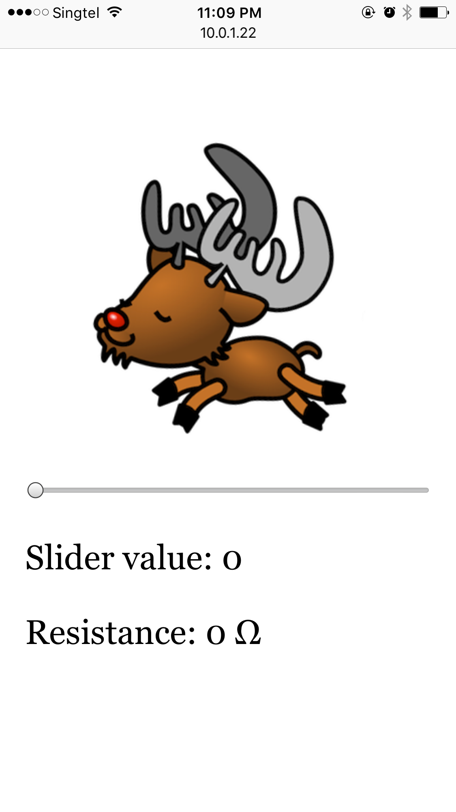

# jumping reindeer

> Turn the potentiometer nob to make the reindeer jump faster!

## Quick start

1. Install packages: `npm i`
- Flash `StandardFirmataPlus` to Arduino Uno
- [Connect the hardware](http://johnny-five.io/examples/potentiometer/) with a potentiometer and Arduino Uno
- Start the web server with `npm start`
- Turn the potentiometer nob to make the reindeer jump faster!

  

## Credit

Thanks to [Pam Selle](http://thewebivore.com/simplifying-animation-with-colliejs-plus-a-dancing-reindeer/)'s reindeer [sprite art](http://thewebivore.com/demos/collie/deer-sprite.png).
